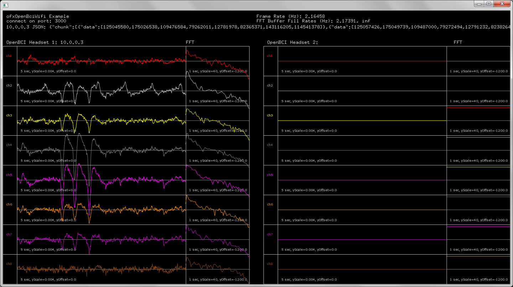

# ofxOpenBciWifi

OpenFrameworks addon for interfacing with OpenBCI via the WiFi shield
- Tested with 2 Cyton boards simultaneously streaming data
- Developed to works with any number of OpenBCI boards

#### ofxOpenBciWifi-example screenshot with 1 connected cyton board

## Requirements:
### ofxAddons for ofxOpenBciWifi:
- ofxNetwork (built in)
- ofxBiquadFilter https://github.com/dzlonline/ofxBiquadFilter
- ofxFft https://github.com/kylemcdonald/ofxFft
- ofxJSON https://github.com/jeffcrouse/ofxJSON
- ofxThreadedLogger https://github.com/produceconsumerobot/ofxThreadedLogger
### Additional ofxAddons for openBciWifi-example:
- ofxOscilloscope https://github.com/produceconsumerobot/ofxOscilloscope

## Instructions:
- Follow OpenBCI WiFi getting started guide to get your OpenBCI connected to your computer and streaming data to the OpenBCI_GUI software. http://docs.openbci.com/Tutorials/03-Wifi_Getting_Started_Guide#wifi-getting-started-guide-prerequisites
- Close the OpenBCI_GUI software and start the openBciWifi-example
- Use Postman to send an HTTP post to the OpenBCI WiFi shield to establish a TCP connection
- Use postman to send an HTTP get to the OpenBCI WiFi shield to start streaming data
-- See API for full documentation https://app.swaggerhub.com/apis/pushtheworld/openbci-wifi-server/1.3.0
